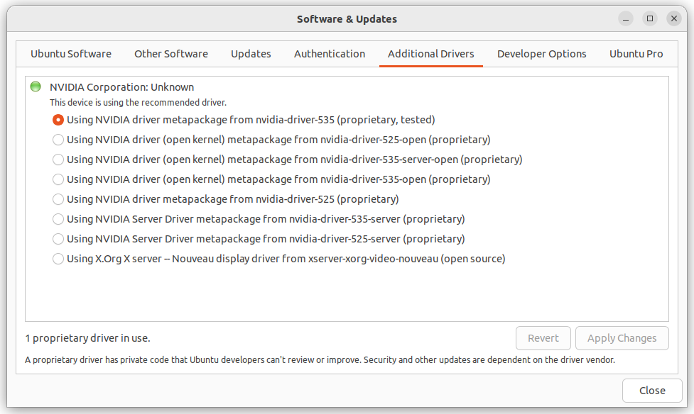
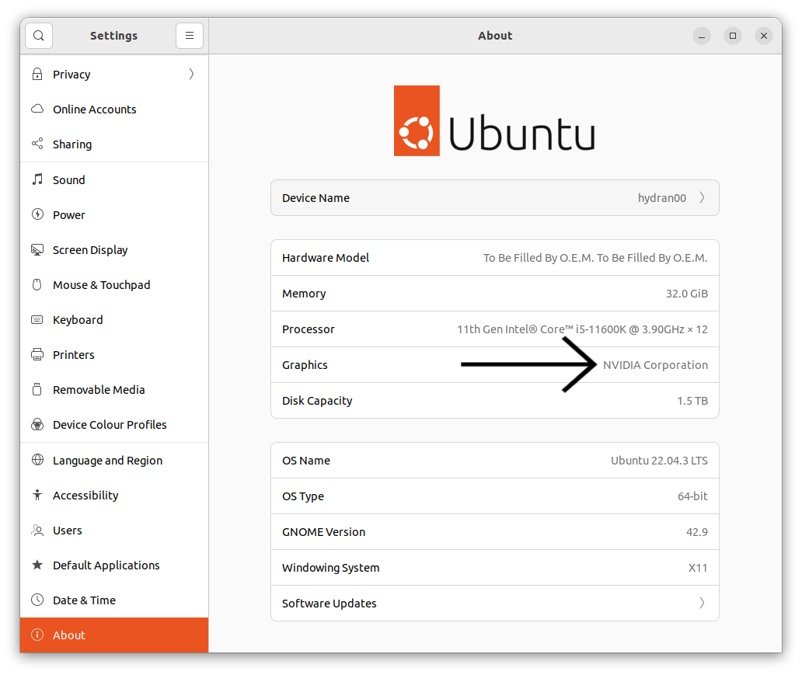

================================
Install Nvidia Drivers in Ubuntu
================================
Before installing Cuda you should if you have a Nvidia GPU and if it is supported by Cuda.
You can check the supported GPUs here: https://developer.nvidia.com/cuda-gpus.
If you do not remember which GPU you have, you can check it with the following command:

.. code-block:: bash

   lspci | grep VGA

Then you have to install the Nvidia driver.

Open the application *Press winkey -> Search "Additional Drivers" -> Select the newest Nvidia driver -> Apply Changes*.
Then reboot the system. (For some motherboard you may have to disable the secure boot).

If the driver are installed correctly you should be able to run:

.. code-block:: bash

      nvidia-smi

You can check if everything is ok looking into *Settings -> About*. You should see something like this:

----------------
Troubleshooting:
----------------
For some laptop with integrated GPU you may have to run the following command:

.. code-block:: bash

      sudo apt install nvidia-prime
      sudo prime-select nvidia

